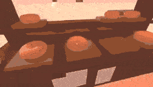

# Godot 4 🍩 Drag & Drop 3D - Demo

### Overview

This is a Godot 4 demo 3D project for my drag & drop module ([repository](https://github.com/JustKesha/godot-dragndrop-3d)) 
Feel free to use it as a starting point for your projects

It includes:
- Basic first-person controls
- Pickup / Drop animations
- On-hover effects

 

### Setting up

1. Download this repo
2. Open Godot (version 4+)
3. Import this repo as a new project (second button on the top left)
4. Open your new project
5. Click run (F5)

Default controls:
- A/W/S/D to move
- LMK (Left mouse key) to drag / drop
- Hold LMK to charge a throw

### Settings

To chance drag & drop settings:
1. Go to `scenes` folder in the FileSystem tab and open `player.tscn`
2. Select the `Raycast` node under `Camera` in the Scene tab
4. In the Inspector tab you will see all available controls right under the `DragAndDrop3D` class

For more info see the [scripts/player_drag.gd](scripts/player_drag.gd) script
